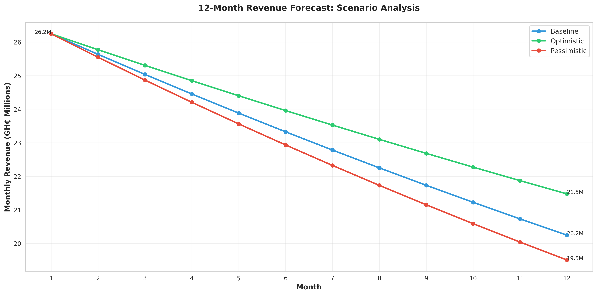
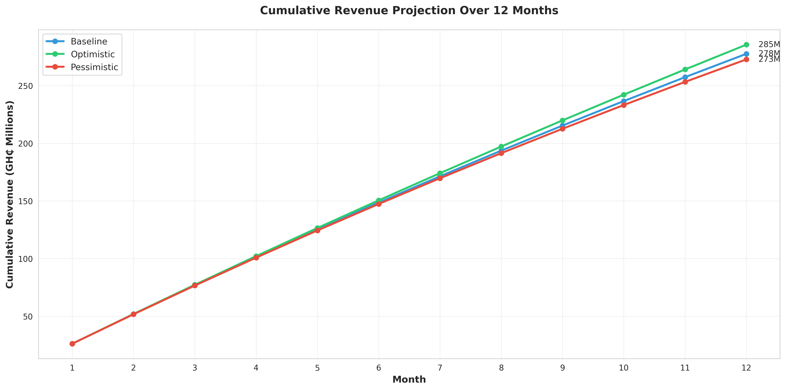
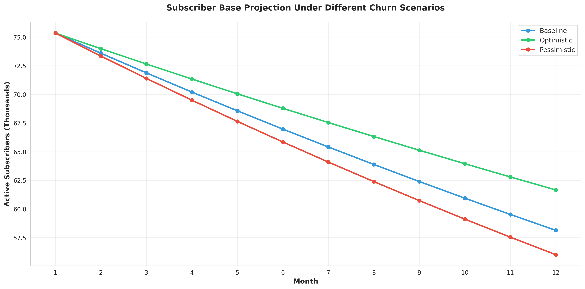
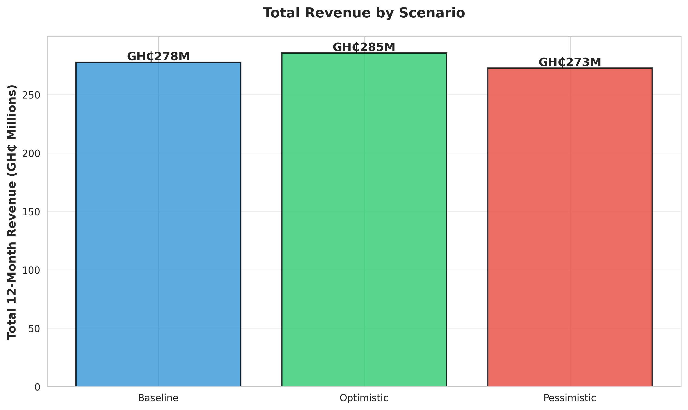

# Telecom Revenue Forecasting: Ghana Market Analysis

**A financial forecasting model for telecom subscriber revenue with scenario analysis**

A 12-month revenue forecasting model for Ghana's telecom market with churn scenario analysis.

---

## Business Problem

Telecom operators need to forecast revenue under different churn scenarios to inform strategic planning and retention investments. This project builds a 12-month revenue forecasting model to:

1. **Quantify revenue at risk** from customer churn
2. **Model financial impact** of retention initiatives
3. **Support strategic planning** with scenario analysis

**Target Use Case:** MIS & Data Science teams need forecasts for weekly, monthly, quarterly, and yearly planning cycles to inform company-wide decision-making.

**Note:** This analysis uses a synthetic dataset of 100,000 customers generated with the [Ghana Telecom Data Generator](https://github.com/Galiishaq/ghana-telecom-data-generator), calibrated to Ghana market statistics (NCA, MTN reports, Census data) to demonstrate forecasting methodology.

---

## Key Findings

### Current State (100,000 Subscriber Base)

| Metric | Value |
|--------|-------|
| **Active Customers** | 75,350 |
| **Annual Churn Rate** | 24.6% |
| **Average ARPU** | GH₵348.31/month |
| **Current Monthly Revenue** | GH₵26.2M |
| **Annual Revenue at Risk** | GH₵103.0M |

### 12-Month Revenue Projections

Three scenarios modeled based on different churn outcomes:

| Scenario | Annual Churn | 12-Month Revenue | vs Baseline |
|----------|--------------|------------------|-------------|
| **Baseline** | 24.6% (current) | GH₵277.5M | - |
| **Optimistic** | 19.6% (-5pp) | GH₵285.5M | **+GH₵7.9M (+2.9%)** |
| **Pessimistic** | 27.6% (+3pp) | GH₵272.7M | **-GH₵4.8M (-1.7%)** |

### Financial Impact Analysis

**Optimistic Scenario (5pp churn reduction):**
- Additional revenue: **GH₵7.9M over 12 months**
- Customers saved from churning: **3,767**
- Revenue growth: **2.9%** with zero new acquisition

**Pessimistic Scenario (3pp churn increase):**
- Revenue loss: **GH₵4.8M**
- Highlights competitive risk without retention focus

### Customer Economics

- **Customer Lifetime Value (CLV):** GH₵8,965.69
- **Average Customer Lifetime:** 42.9 months
- **Revenue per 1pp churn reduction:** GH₵1.58M annually

**ROI of Retention:** Even spending **GH₵300 per customer** on retention initiatives yields positive ROI given the CLV of GH₵8,965.

---

## Visualizations

### 1. Monthly Revenue Projection


This chart shows how monthly revenue decays over 12 months under three churn scenarios. The compounding nature of churn is evident - by month 12, there's a **GH₵3.1M monthly revenue gap** between optimistic and pessimistic scenarios.

### 2. Cumulative Revenue Comparison


Total revenue accumulation over the year. The **GH₵7.9M gap** between baseline and optimistic scenarios comes from retention alone - no acquisition cost required.

### 3. Subscriber Retention Forecast


Active customer base projection showing how churn erodes the subscriber base. Without intervention, we lose **~18,650 customers** (24.8%) in 12 months at current churn rates.

### 4. Scenario Comparison


Quick visual summary of total 12-month revenue across all three scenarios.

---

## Methodology

### Forecasting Formula

```
Revenue(month_n) = Active_Subscribers(month_n) × Average_ARPU
Active_Subscribers(month_n) = Active_Subscribers(month_n-1) × (1 - Monthly_Churn_Rate)
```

### Assumptions

- **ARPU remains constant** at GH₵348.31 (conservative assumption)
- **No new subscriber acquisition** (isolates churn impact)
- **Churn compounds monthly** (realistic decay model)
- **Gross margin:** 60% (telecom industry standard)

### Data Source

Dataset generated using the [Ghana Telecom Data Generator](https://github.com/Galiishaq/ghana-telecom-data-generator).

Analysis uses 100,000 synthetic customer records calibrated to:
- National Communications Authority (NCA) Q4 2024 data
- MTN Ghana 2024 financial reports
- Ghana Statistical Service 2021 Census

Dataset includes ARPU, usage patterns, churn status, demographics, and behavioral indicators across all 16 Ghana regions.

---

## Strategic Recommendations

Based on the forecast analysis:

1. **Prioritize Retention Over Acquisition**
   - Every 1pp churn reduction = GH₵1.58M additional revenue
   - Retention spend up to GH₵300/customer shows positive ROI

2. **Target High-Risk Segments**
   - Focus on "At-Risk" segment (83.5% churn rate)
   - Implement early warning systems using usage patterns and support calls

3. **Regional Strategy**
   - Address network quality in Northern regions (higher churn)
   - Invest in infrastructure where churn is elevated

4. **Monthly Monitoring**
   - Track actual vs. forecasted revenue
   - Recalibrate scenarios quarterly based on market conditions

---

## Technologies Used

**Analysis & Modeling:**
- Python 3.9+
- pandas (data manipulation)
- NumPy (numerical calculations)

**Visualization:**
- matplotlib
- seaborn

**Environment:**
- Jupyter Notebook (interactive analysis)

---

## Project Structure

```
telecom-revenue-forecasting/
├── data/
│   └── ghana_telecom_customers.csv      # 100K customer dataset
├── notebooks/
│   └── revenue_forecasting_analysis.ipynb  # Main analysis
├── images/                               # Generated visualizations
├── requirements.txt                      # Python dependencies
└── README.md                             # This file
```

---

## How to Use

### 1. Clone and Setup

```bash
# Navigate to project directory
cd telecom-revenue-forecasting

# Create virtual environment
python -m venv .venv
source .venv/bin/activate  # On Windows: .venv\Scripts\activate

# Install dependencies
pip install -r requirements.txt
```

### 2. Run the Analysis

```bash
# Launch Jupyter Notebook
jupyter notebook notebooks/revenue_forecasting_analysis.ipynb
```

Run all cells to:
- Load the customer dataset
- Calculate current state metrics
- Generate 12-month forecasts for all scenarios
- Create visualizations
- Export summary data

### 3. Review Results

- **Notebook output:** Detailed metrics and commentary
- **Visualizations:** Saved to `images/` directory
- **Summary data:** Exported to `data/forecast_summary.csv`

---

## Business Impact

This forecasting model enables:

- **Data-driven budget planning** - Realistic revenue projections for financial planning
- **Retention ROI justification** - Quantify investment needed for churn reduction
- **Risk assessment** - Understand downside scenarios and competitive threats
- **Strategic decision support** - Model "what-if" scenarios for leadership

MIS & Data Science teams can use this framework for weekly, monthly, quarterly, and yearly forecasts.

---

## Why This Project?

I built this to practice financial modeling for telecom contexts:

- Financial modeling and forecasting
- Scenario analysis and risk assessment
- Quantitative analysis with business context
- Revenue optimization focus
- Strategic recommendations backed by data
- Ghana market knowledge (NCA/MTN calibration)

---

## Future Enhancements

Potential extensions to this analysis:

- **Customer Lifetime Value (CLV) by segment** - Separate forecasts for high/low value customers
- **Regional profitability analysis** - Revenue forecasts across all 16 Ghana regions
- **Cross-sell revenue modeling** - Impact of upselling data bundles to voice users
- **Time-series forecasting** - ARIMA/Prophet models with historical trends
- **Monte Carlo simulation** - Probabilistic forecasting with uncertainty bounds

---

## Contact

**Mufti Ishaq**
Email: galiishaq@gmail.com
LinkedIn: [linkedin.com/in/muftawu-ishaq](https://linkedin.com/in/muftawu-ishaq-85699a271)
GitHub: [@galiishaq](https://github.com/galiishaq)

---

## License

This project is open source and available under the MIT License.

---

*A revenue forecasting model calibrated to Ghana's telecom market.*
